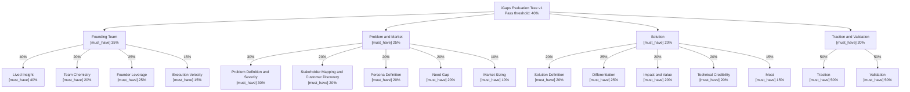

# iGaps Evaluation Tree (Mermaid — top 2 levels)

Generated: 2026-05-22T11:24:40.380Z

```mermaid
flowchart TD
  ROOT["iGaps Evaluation Tree v1\nPass threshold: 40%"]
  trackA["Founding Team\n[must_have] 35%"]
  trackA_L1["Lived Insight\n[must_have] 40%"]
  trackA_L2["Team Chemistry\n[must_have] 20%"]
  trackA_L3["Founder Leverage\n[must_have] 25%"]
  trackA_L4["Execution Velocity\n[must_have] 15%"]
  trackB["Problem and Market\n[must_have] 25%"]
  trackB_L1["Problem Definition and Severity\n[must_have] 30%"]
  trackB_L2["Stakeholder Mapping and Customer Discovery\n[must_have] 20%"]
  trackB_L3["Persona Definition\n[must_have] 20%"]
  trackB_L4["Need Gap\n[must_have] 20%"]
  trackB_L5["Market Sizing\n[must_have] 10%"]
  trackC["Solution\n[must_have] 20%"]
  trackC_L1["Solution Definition\n[must_have] 20%"]
  trackC_L2["Differentiation\n[must_have] 25%"]
  trackC_L3["Impact and Value\n[must_have] 20%"]
  trackC_L4["Technical Credibility\n[must_have] 20%"]
  trackC_L5["Moat\n[must_have] 15%"]
  trackD["Traction and Validation\n[must_have] 20%"]
  trackD_L1["Traction\n[must_have] 50%"]
  trackD_L2["Validation\n[must_have] 50%"]
  ROOT --> trackA
  ROOT --> trackB
  ROOT --> trackC
  ROOT --> trackD
  trackA -->|"40%"| trackA_L1
  trackA -->|"20%"| trackA_L2
  trackA -->|"25%"| trackA_L3
  trackA -->|"15%"| trackA_L4
  trackB -->|"30%"| trackB_L1
  trackB -->|"20%"| trackB_L2
  trackB -->|"20%"| trackB_L3
  trackB -->|"20%"| trackB_L4
  trackB -->|"10%"| trackB_L5
  trackC -->|"20%"| trackC_L1
  trackC -->|"25%"| trackC_L2
  trackC -->|"20%"| trackC_L3
  trackC -->|"20%"| trackC_L4
  trackC -->|"15%"| trackC_L5
  trackD -->|"50%"| trackD_L1
  trackD -->|"50%"| trackD_L2
```
